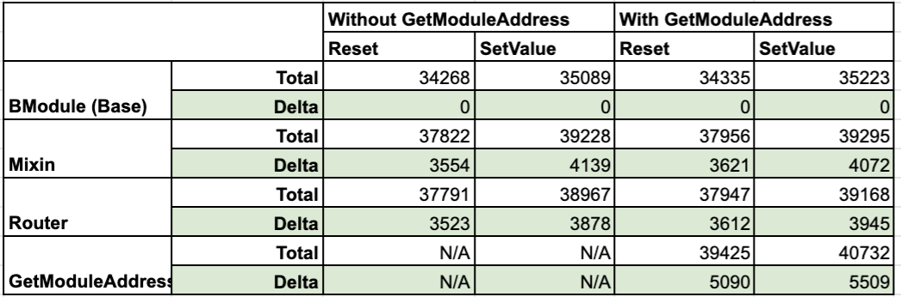

# Tests on inter module communications

## Concepts
This POC adds another option that is a pure function in the router to resolve for the address, so that all modules can directly query the address from the router.

This will simplify the deploy script and architecture without the need to add one (or several) mixin to resolve the addresses and all the generated data will be consolidated in the router.

On the other side, it adds a public function that will force the EVM to have a selector function in the router and hence will add some gas to every router usage.

This POC is used to get some stats on the different approaches to make an informed decision on which option is better.

## Results

### Router with GetModuleAddress function (not only fallback)
This section shows the gas consumption by method with the resolve function in the router.

#### Direct access to the contract (Control group)
Directly accesing BModule 
- Reset Value: 34335
- Set Value: 35223
- Increment on Reset Value: 0 (control)
- Increment on Set Value: 0 (control)

#### Using the mixin
Accessing BModule functions via AMdule using the mixin and using DelegateCall
- Reset Value: 37956
- Set Value: 39295
- Increment on Reset Value: 3621
- Increment on Set Value: 4072

#### Using the Router
Accessing BModule functions via AMdule using the router
- Reset Value: 37947
- Set Value: 39168
- Increment on Reset Value: 3612
- Increment on Set Value: 3945

#### Using GetModuleAddress
Accessing BModule functions via AMdule using the router GetModuleAddress pure function
- Reset Value: 39425
- Set Value: 40732
- Increment on Reset Value: 5090
- Increment on Set Value: 5509

### Router without GetModuleAddress function (only fallback in router)
This section shows the gas consumption by method without the resolve function in the router (router only has the fallback).

#### Direct access to the contract (Control group)
Directly accesing BModule 
- Reset Value: 34268
- Set Value: 35089
- Increment on Reset Value: 0 (control)
- Increment on Set Value: 0 (control)

#### Using the mixin
Accessing BModule functions via AMdule using the mixin and using DelegateCall
- Reset Value: 37822
- Set Value: 39228
- Increment on Reset Value: 3554
- Increment on Set Value: 4139

#### Using the Router
Accessing BModule functions via AMdule using the router
- Reset Value: 37791
- Set Value: 38967
- Increment on Reset Value: 3523
- Increment on Set Value: 3878

#### Using GetModuleAddress
N/A in this configuration
- Reset Value: --
- Set Value: --
- Increment on Reset Value: --
- Increment on Set Value: --

### Conclusion
The best option to intermodule communications is to use the router and not include any addressResolver.

