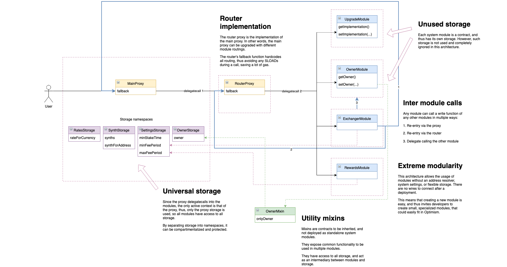

## "Router Proxy" POC #5

This proof of concept combines a single universal proxy with a hardcoded lookup table, or router, which maps function selectors to the implementation contract where such selector is implemented.

For a simpler, easier to understand, but more primitive version of this experiment, see POC #4.

The router contract is dynamically generated by looking at the existing modules, resulting in something like:

```
// Lookup table: Function selector => implementation contract
bytes4 sig4 = msg.sig;
address implementation;
assembly {
    let sig32 := shr(224, sig4)

    function findImplementation(sig) -> result {
        let SettingsModule := 0x1D8D70AD07C8E7E442AD78E4AC0A16f958Eba7F0
        let UpgradeModule := 0xA9e6Bfa2BF53dE88FEb19761D9b2eE2e821bF1Bf
        let OwnerModule := 0x1E3b98102e19D3a164d239BdD190913C2F02E756

        switch sig
        case 0x13af4035 { result := OwnerModule } // OwnerModule.setOwner()
        case 0x3659cfe6 { result := UpgradeModule } // UpgradeModule.upgradeTo()
        case 0x38536275 { result := SettingsModule } // SettingsModule.setMinCollateralRatio()
        case 0x4c8f35ab { result := SettingsModule } // SettingsModule.getMinCollateralRatio()
        case 0x893d20e8 { result := OwnerModule } // OwnerModule.getOwner()
        case 0xaaf10f42 { result := UpgradeModule } // UpgradeModule.getImplementation()
        leave
    }

    implementation := findImplementation(sig32)
}
```

In theory, the router could handle a large amount of selectors, but if the amount increases, selectors at the end of the list would have more gas overhead than the ones at the top of the list. Thus, the generator uses a binary search instead of a linear one, ensuring that switch statements in the router contain at most 7 elements.



### Communication between modules

Modules can call functions from other modules in several ways. Each method has different usage difficulty, but results in very different gas costs.

1. **Casting method**

The most obvious one, and the easiest to use, is by having the caller module cast itself as the callee module. This is possible because all modules act in the same environment. The downside of this method is that an external call is made, which goes through the main proxy, then router, then callee module.

```
contract AModule {
    function setValueViaBModule_cast(uint newValue) public {
        BModule(address(this)).setValue(newValue);
    }
}
```

```
contract BModule {
    function setValue(uint newValue) public {
        _globalStorage().value = newValue;
    }
}
```

Gas overhead: ~4500

2. **Router method**

Instead of making an external call that re-enters the system via the proxy, modules can call the router instead, thus saving a bit of gas. Modules need only to access the proxy storage namespace.

```
contract AModule {
    function setValueViaBModule_router(uint newValue) public {
        (bool success,) = getRouter().delegatecall(
            abi.encodeWithSelector(BModule.setValue.selector, newValue)
        );

        require(success, "Delegatecall failed");
    }
}
```

Gas overhead: ~3300

3. **Direct method**

TBD

Under research:
* Using storage results in ~3300 gas, but it sucks to have to store the modules in two places
* Exposing the modules via an interface in the Router works, but it involves 2 calls, one to query the module address in the router, and another one to make the actual call to the library, so its just slightly more efficient that the router method.

**Which method to use?**

If a module rarely calls another module, i.e. an admin or owner function, it should be fine to use method 1. However, if a user facing function needs to call another module, options 2 and 3 should be considered. Also, if the user facing function calls other modules a lot, developers should consider abstracting part of the callee module to a mixin, and execute the logic with no external calls.

### Storage namespaces

To avoid storage collisions, modules must not declare in-contract variables, but instead access a storage namespace. This deviates signifficanlty from regular Solidity code style, but should not introduce too much complexity for developers.

```
bytes32 constant GLOBAL_STORAGE_POSITION = keccak256("io.synthetix.global");

struct GlobalStorage {
    address owner;
    string version;
}

function globalStorage() internal pure returns (GlobalStorage storage store) {
    bytes32 position = GLOBAL_STORAGE_POSITION;

    assembly {
        store.slot := position
    }
}
```

Any number of additional namespaces can be declared, i.e.

```
...
bytes32 constant ISSUANCE_STORAGE_POSITION = keccak256("io.synthetix.issuance");
...
bytes32 constant COLLATERAL_STORAGE_POSITION = keccak256("io.synthetix.collateral");
...
```

The only caveat is that storage within a namespace is append only. Properties within a namespace cannot be renamed or reordered, and new properties can only be appended to a struct.

### Mixins

Additionally, mixins, which are not modules, can be inherited by any module for accessing common functionality.

```
contract OwnerMixin is GlobalStorageAccessor {
    modifier onlyOwner {
        require(msg.sender == globalStorage().owner, "Only owner allowed");
        _;
    }
}
```

Thus, the general architecture can be categorized as follows:

* Storage namespaces: Provide a storage structure for a particular functionality. E.g. GlobalStorage, or IssuerStorage.
* Modules: Implement a specific compartimentalized feature of the system, accessing one or more storage namespaces, and requiring an implementation contract to be deployed and hardcoded into the main proxy.
* Mixins: Intended to be inherited by modules, can access any storage namespace, add functions and modifiers to a module, and are not intended to be deployed as an implementation contract. E.g. OwnerMixin.
* Libraries: Provide common functionality to modules, without inheriting. E.g. SafeDecimalMath.

### Brick risk

Since the main proxy is a UUPS proxy, its admin upgradeability code is stored in the implementation. This saves a lot of gas for non-admin interactions with the system, but introduces the risk of the system being upgraded to a non-upgradeable implementation. If this happens, such an upgrade would effectively be the last upgrade of the system, and the system would be considered "bricked".

This could happen for example if the system is updated to a router that doesn't have an UpgradeModule, and none of the other modules are able to write to the 'eip1967.proxy.implementation' storage namespace.

Basic mitigations implemented in this POC are:
* Don't have an address of 0x0
* The new implementation is a contract
* The new implementation has a isUpgradeable selector which returns true

A more advanced mitigation performs a second upgrade on the incoming upgrade, setting the implementation to a contract that will respond in an expected way. This second upgrade is done in an external call, and is always reverted without affecting the main execution thread. If the second upgrade did not respond as expected, the main execution thread is reverted as well, and the upgrade is thus rejected.

Of course, additional safety measures could be implemented, such as pre-running deployments on a fork, and verifying that the new implementation could in fact receive further upgrades.

### Development considerations

Developers will need to:
* Only use storage via namespaces
* Always append variables to a namespace storage struct (enforced by tooling)
* All functions in modules need to be unique (enforced by tooling)
* An incorrect update could make the main proxy no longer upgradeable, effectively bricking it

The lookup table in the main proxy's implementation is generated in order to reduce a bit of gas, but mainly for removing any kind of diamond proxy complexity from the Solidity code.

### Testing this experiment locally

1. Start local node with `npx hardhat node`
2. Deploy the system with `npx hardhat run scripts/deploy.js`
3. Run tests with `npx hardhat test`

Additionally, step 2 can be broken up into these commands:
* Clear local deployment data with `npx hardhat run scripts/clear-deployments.js`
* Deploy system moduels with `npx hardhat run scripts/deploy-modules.js`
* Generate main proxy router with `npx hardhat run scripts/generate-router.js`
* Deploy main proxy router `npx hardhat run scripts/deploy-proxy.js`
* Poulate the RegistryModule (optional) `npx hardhat run scripts/register-modules.js`

Incremental upgrades can then be done by:
* Generate main proxy router with `npx hardhat run scripts/generate-router.js`
* Upgrade the main proxy `npx hardhat run scripts/upgrade-router.js`

### Differences with POC #4

This experiment continues where POC #4 left of.

1. Cheaper proxying

Instead of using OpenZeppelin transparent proxies, UUPS proxies are used (Universal Upgradeable Proxy Standard). See https://eips.ethereum.org/EIPS/eip-1822

Transparent proxies have a forwarding overhead of around ~3000 gas, while UUPS only add nearly half as much, ~1600 gas. This, combined with the router adds an overhead of ~2600 gas, is less than a system only using transparent proxies.

Of course, this could increase with a larger router, which could be later optimized with lower level code generation and/or implementing a binary search in the routing.

Universal proxies achieve this optimization by placing the upgradeability management code in the implementation, instead of the proxy. Thus, it avoids checking if the caller is the admin on every single interaction with the system. The downside is that an incorrect implementation could brick the proxy. Fran and I believe, however, that this problem could be mitigated by checks on the upgrade logic and good tooling.

2. Optimized router

Even though the router is pretty efficient, it quickly loses efficiency as the number of selectors increases. This is because the bytecode produced by Solidity for simple "if" matching is quite poor.

This POC uses Yul for router code, and implements binary instead of linear search for the actual routing.

A router whose code is too large to deploy with POC #4 generation, is only ~9kb with this new generator.

### Integration with OpenZeppelin Defender

TBD

### Open questions

TBD
